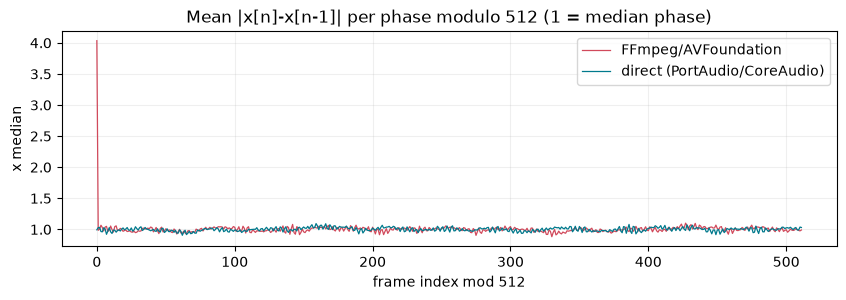
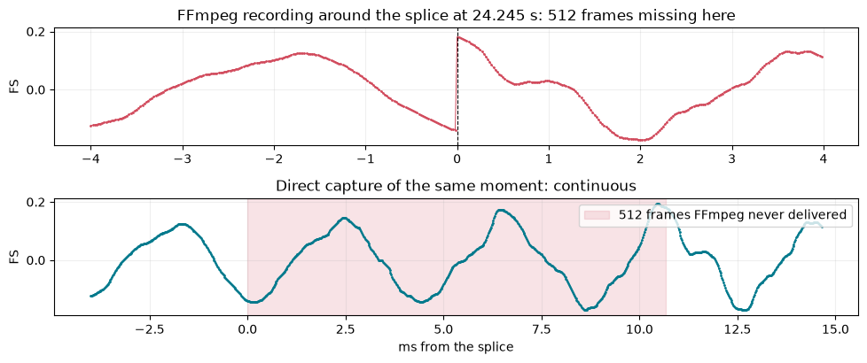
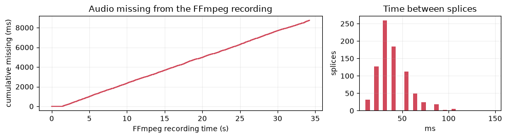
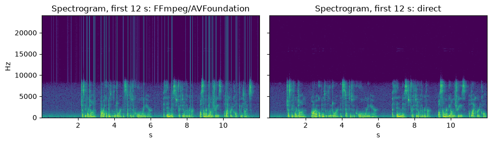
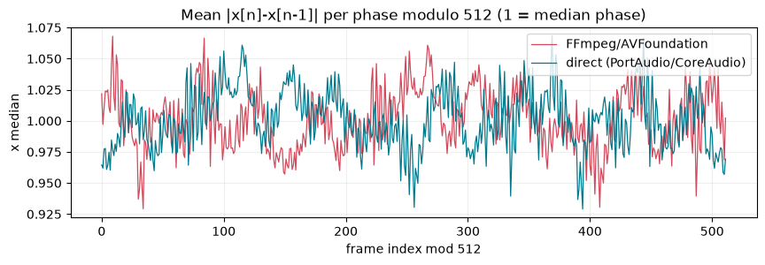
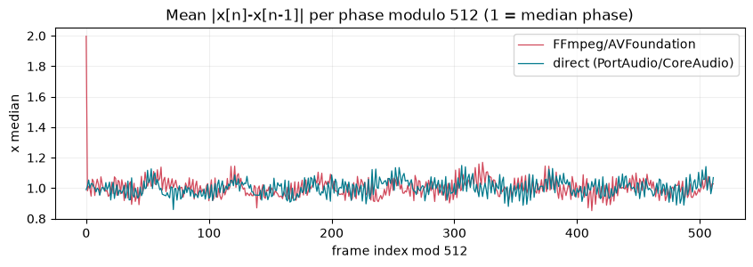

# Validation 2026-09-30 14:21: Homebrew FFmpeg 8.1.1 and FFmpeg git-2026-07-03-ddf8f40 (source build)

**[Open the full report](https://heymarcell.github.io/xvf3800-usb-audio-diagnostics/results/issue-39/validation-20260930-142153/report.html)** (every trial, every diagram) · [summary](SUMMARY.md) · [raw numbers](results.json) · [hashes](manifest.json)

## Key figures

**`ffmpeg -t N` alone: requested length vs audio actually in the file**

**Homebrew FFmpeg vs direct capture of the same moment: mean sample-to-sample step per phase modulo 512 (xvf48k_homebrew_ab1)**

**The largest splice in the Homebrew FFmpeg recording, and the 512 frames it never delivered (xvf48k_homebrew_ab1)**

**Audio missing from the Homebrew FFmpeg recording over time, and the time between splices (xvf48k_homebrew_ab1)**

**Spectrograms: the splices show as vertical broadband lines in the FFmpeg recording only (xvf48k_homebrew_ab1)**

**FFmpeg at the fix commit vs direct capture: no excess at any phase (xvf48k_fixed_ab1)**

**The MacBook built-in microphone through Homebrew FFmpeg: the same splices without the XVF3800 (builtin_mic_homebrew_ab)**

## Summary

- Host: macOS-26.5.1-arm64-arm-64bit-Mach-O
- Python: 3.14.5
- Homebrew FFmpeg: ffmpeg version 8.1.1 Copyright (c) 2000-2026 the FFmpeg developers
- Runner: xvfdiag 1.2.0
- Board firmware before / after: v2.1.1_native16k / v2.1.1_native16k

## Stages

| Stage | Result |
|---|---|
| unit | ✅ 114 passed, 6 skipped in 124.53s (0:02:04) |
| upstream | ✅ 3 passed in 2.46s |
| readonly | ✅ 3 passed in 2.19s |
| ffmpeg | ✅ ffmpeg version git-2026-07-03-ddf8f40 Copyright (c) 2000-2026 the FFmpeg developers |
| matrix | ✅ ok |
| hostpath | ✅ ok |

## Diagnostic matrix (direct capture)

Session: `matrix/xvf3800-diagnostic-20260930-142409`

| Firmware | Route | Result | ch0 periodicity | ch1 periodicity | 48 kHz signature | FFmpeg control |
|---|---|---|---|---|---|---|
| v2.1.0_48k2ch | normal_ambient | no strong periodic-click signature | none (strongest P=2048: x1.16, z=3.7) | none (strongest P=2048: x1.16, z=3.7) | zero-stuffed 3x upsampling (full-strength images above 8 kHz) | - |
| v2.1.0_48k2ch | normal | no strong periodic-click signature | none (strongest P=1024: x1.07, z=3.0) | none (strongest P=1024: x1.07, z=4.0) | zero-stuffed 3x upsampling (full-strength images above 8 kHz) | no strong periodic-click signature; 1277 splices, 655872 frames (13.66 s) missing; 7534/7534 located 512-frame blocks identical |
| v2.1.1_48k2ch | normal_ambient | no strong periodic-click signature | none (strongest P=960: x1.10, z=4.4) | none (strongest P=960: x1.10, z=4.3) | band-limited to 8 kHz (filtered upsampling of the 16 kHz path) | - |
| v2.1.1_48k2ch | normal | no strong periodic-click signature | none (strongest P=480: x1.08, z=3.1) | none (strongest P=960: x1.17, z=5.0) | band-limited to 8 kHz (filtered upsampling of the 16 kHz path) | periodic discontinuity signature; 1798 splices, 922624 frames (19.22 s) missing; 7013/7013 located 512-frame blocks identical |
| v2.1.1_48k2ch | raw | no strong periodic-click signature | none (strongest P=960: x1.16, z=4.1) | none (strongest P=960: x1.17, z=4.2) | band-limited to 8 kHz (filtered upsampling of the 16 kHz path) | - |
| v2.1.1_48k2ch | pre_shf | no strong periodic-click signature | none (strongest P=960: x1.18, z=5.0) | none (strongest P=960: x1.16, z=4.1) | band-limited to 8 kHz (filtered upsampling of the 16 kHz path) | - |
| v2.1.1_48k2ch | shf_input | no strong periodic-click signature | none (strongest P=480: x1.10, z=3.3) | none (strongest P=960: x1.18, z=5.1) | band-limited to 8 kHz (filtered upsampling of the 16 kHz path) | - |
| v2.1.1_48k2ch | processed_direct | no strong periodic-click signature | none (strongest P=960: x1.21, z=5.6) | none (strongest P=960: x1.17, z=5.0) | band-limited to 8 kHz (filtered upsampling of the 16 kHz path) | - |
| v2.1.1_48k2ch | processed_no_upsample | no strong periodic-click signature | none (strongest P=960: x1.20, z=5.3) | none (strongest P=960: x1.19, z=5.2) | band-limited to 8 kHz (filtered upsampling of the 16 kHz path) | - |
| v2.1.1_native16k | normal_ambient | no strong periodic-click signature | none (strongest P=2048: x1.91, z=6.3) | none (strongest P=2048: x1.57, z=7.5) | native 16 kHz | - |
| v2.1.1_native16k | normal | no strong periodic-click signature | none (strongest P=2048: x1.23, z=3.5) | none (strongest P=2048: x1.22, z=3.8) | native 16 kHz | no strong periodic-click signature; 0 splices, 0 frames (0.00 s) missing; 2940/2940 located 512-frame blocks identical |
| v2.1.1_native16k | raw | no strong periodic-click signature | none (strongest P=2048: x1.20, z=3.1) | none (strongest P=2048: x1.17, z=3.4) | native 16 kHz | - |

## Same input, captured through FFmpeg/AVFoundation and directly at the same time

| Trial | Located blocks identical (≤1 LSB) | Splices | Audio missing | Splice phase mod 512 | FFmpeg recording | Direct recording |
|---|---|---|---|---|---|---|
| xvf48k_homebrew_ab1 | 3082/3082 (3082) | 817 | 20.1% | [0] | periodic discontinuity signature | no strong periodic-click signature |
| xvf48k_homebrew_ab2 | 3083/3083 (3083) | 811 | 20.2% | [0] | periodic discontinuity signature | no strong periodic-click signature |
| xvf48k_homebrew_ab3 | 3115/3115 (3115) | 783 | 19.4% | [0] | periodic discontinuity signature | no strong periodic-click signature |
| xvf48k_fixed_ab1 | 3903/3903 (3903) | 0 | 0.0% | [] | no strong periodic-click signature | no strong periodic-click signature |
| xvf48k_fixed_ab2 | 3903/3903 (3903) | 0 | 0.0% | [] | no strong periodic-click signature | no strong periodic-click signature |
| xvf48k_fixed_ab3 | 3903/3903 (3903) | 0 | 0.0% | [] | no strong periodic-click signature | no strong periodic-click signature |
| builtin_mic_homebrew_ab | 0/3083 (3083) | 758 | 18.8% | [0] | periodic discontinuity signature | no strong periodic-click signature |
| builtin_mic_fixed_ab | 0/3833 (3833) | 0 | 0.0% | [] | no strong periodic-click signature | no strong periodic-click signature |
| xvf16k_homebrew_ab | 1303/1303 (1303) | 0 | 0.0% | [] | no strong periodic-click signature | no strong periodic-click signature |

## `ffmpeg -t N` alone (the original report's method)

| Trial | Requested | Audio held | Missing | Recording |
|---|---|---|---|---|
| xvf48k_homebrew_duration30 | 30 s | 23.611 s | 21.3% | periodic discontinuity signature |
| xvf48k_fixed_duration30 | 30 s | 30.000 s | 0.0% | no strong periodic-click signature |
| builtin_mic_homebrew_duration20 | 20 s | 16.107 s | 19.5% | periodic discontinuity signature |
| builtin_mic_fixed_duration20 | 20 s | 20.000 s | 0.0% | no strong periodic-click signature |
| xvf16k_homebrew_duration30 | 30 s | 30.000 s | 0.0% | no strong periodic-click signature |
