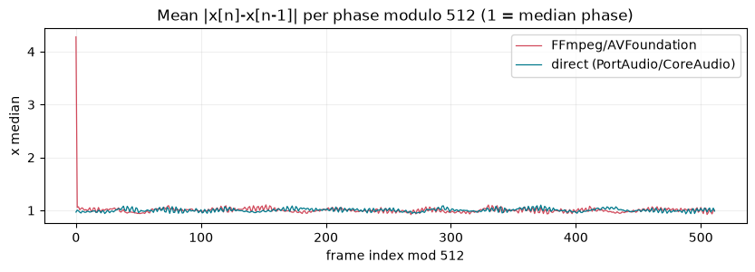
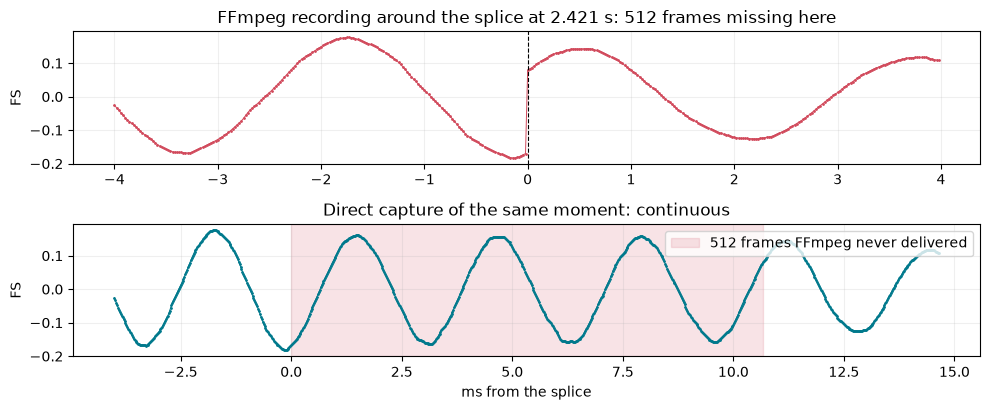
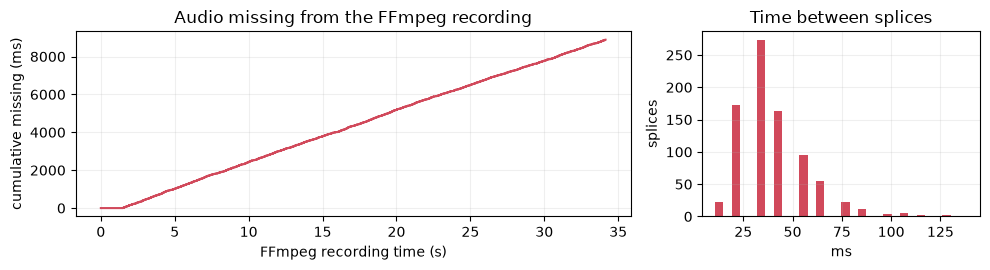
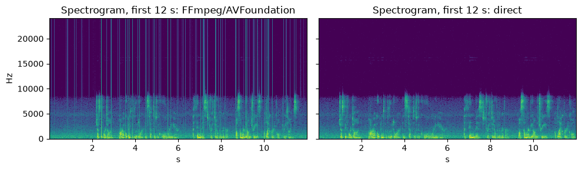
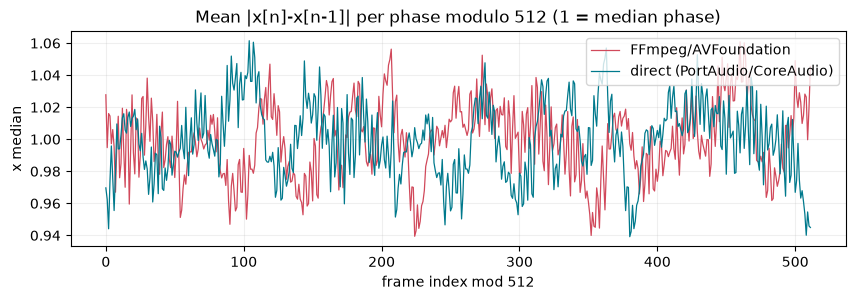
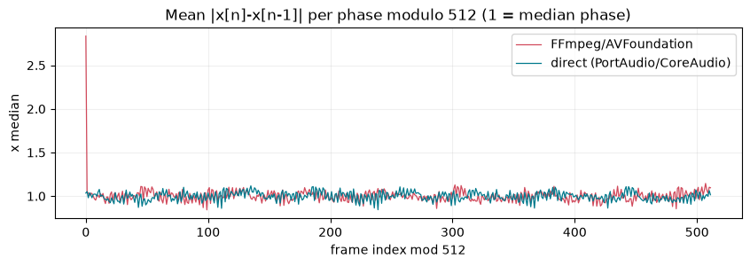

# Validation 2026-09-30 18:58: Homebrew FFmpeg 9.0.2 and FFmpeg git-2026-09-30-e9dc8fd (source build)

**[Open the full report](https://heymarcell.github.io/xvf3800-usb-audio-diagnostics/results/issue-39/validation-20260930-185836/report.html)** (every trial, every diagram) · [matrix report](https://heymarcell.github.io/xvf3800-usb-audio-diagnostics/results/issue-39/validation-20260930-185836/matrix-report.html) (every checkpoint: waveforms, spectra, spectrograms) · [summary](SUMMARY.md) · [raw numbers](results.json) · [hashes](manifest.json)

## Key figures

**`ffmpeg -t N` alone: requested length vs audio actually in the file**

**Homebrew FFmpeg vs direct capture of the same moment: mean sample-to-sample step per phase modulo 512 (xvf48k_homebrew_ab1)**

**The largest splice in the Homebrew FFmpeg recording, and the 512 frames it never delivered (xvf48k_homebrew_ab1)**

**Audio missing from the Homebrew FFmpeg recording over time, and the time between splices (xvf48k_homebrew_ab1)**

**Spectrograms: the splices show as vertical broadband lines in the FFmpeg recording only (xvf48k_homebrew_ab1)**

**FFmpeg master vs direct capture: no excess at any phase (xvf48k_master_ab1)**

**The MacBook built-in microphone through Homebrew FFmpeg: the same splices without the XVF3800 (builtin_mic_homebrew_ab)**

## Summary

- Host: macOS-26.5.1-arm64-arm-64bit-Mach-O
- Python: 3.14.5
- Homebrew FFmpeg: ffmpeg version 9.0.2 Copyright (c) 2000-2026 the FFmpeg developers
- Runner: xvfdiag 1.2.0
- Board firmware before / after: v2.1.1_native16k / v2.1.1_48k2ch

## Stages

| Stage | Result |
|---|---|
| unit | ✅ 114 passed, 6 skipped in 112.96s (0:01:52) |
| upstream | ✅ 3 passed in 2.42s |
| readonly | ✅ 3 passed in 1.97s |
| ffmpeg | ✅ ffmpeg version git-2026-09-30-e9dc8fd Copyright (c) 2000-2026 the FFmpeg developers |
| matrix | ✅ ok |
| hostpath | ✅ ok |

## Diagnostic matrix (direct capture)

Session: `matrix/xvf3800-diagnostic-20260930-190038`

| Firmware | Route | Result | ch0 periodicity | ch1 periodicity | 48 kHz signature | FFmpeg control |
|---|---|---|---|---|---|---|
| v2.1.0_48k2ch | normal_ambient | no strong periodic-click signature | none (strongest P=2048: x1.16, z=4.3) | none (strongest P=960: x1.10, z=2.0) | zero-stuffed 3x upsampling (full-strength images above 8 kHz) | - |
| v2.1.0_48k2ch | normal | no strong periodic-click signature | none (strongest P=960: x1.06, z=1.8) | none (strongest P=960: x1.06, z=1.9) | zero-stuffed 3x upsampling (full-strength images above 8 kHz) | no strong periodic-click signature; 1071 splices, 549888 frames (11.46 s) missing; 7740/7740 located 512-frame blocks identical |
| v2.1.1_48k2ch | normal_ambient | no strong periodic-click signature | none (strongest P=720: x1.07, z=3.6) | none (strongest P=1024: x1.07, z=3.0) | band-limited to 8 kHz (filtered upsampling of the 16 kHz path) | - |
| v2.1.1_48k2ch | normal | no strong periodic-click signature | none (strongest P=480: x1.10, z=4.1) | none (strongest P=480: x1.12, z=4.9) | band-limited to 8 kHz (filtered upsampling of the 16 kHz path) | periodic discontinuity signature; 1958 splices, 1007616 frames (20.99 s) missing; 6855/6855 located 512-frame blocks identical |
| v2.1.1_48k2ch | raw | no strong periodic-click signature | none (strongest P=480: x1.13, z=4.1) | none (strongest P=480: x1.11, z=3.6) | band-limited to 8 kHz (filtered upsampling of the 16 kHz path) | - |
| v2.1.1_48k2ch | pre_shf | no strong periodic-click signature | none (strongest P=480: x1.11, z=3.4) | none (strongest P=960: x1.15, z=3.8) | band-limited to 8 kHz (filtered upsampling of the 16 kHz path) | - |
| v2.1.1_48k2ch | shf_input | no strong periodic-click signature | none (strongest P=480: x1.11, z=3.7) | none (strongest P=480: x1.08, z=3.1) | band-limited to 8 kHz (filtered upsampling of the 16 kHz path) | - |
| v2.1.1_48k2ch | processed_direct | no strong periodic-click signature | none (strongest P=480: x1.15, z=5.5) | none (strongest P=960: x1.23, z=6.4) | band-limited to 8 kHz (filtered upsampling of the 16 kHz path) | - |
| v2.1.1_48k2ch | processed_no_upsample | no strong periodic-click signature | none (strongest P=480: x1.15, z=5.5) | none (strongest P=480: x1.14, z=5.3) | band-limited to 8 kHz (filtered upsampling of the 16 kHz path) | - |
| v2.1.1_native16k | normal_ambient | no strong periodic-click signature | none (strongest P=1024: x1.14, z=3.0) | none (strongest P=1024: x1.14, z=2.9) | native 16 kHz | - |
| v2.1.1_native16k | normal | no strong periodic-click signature | none (strongest P=1024: x1.15, z=3.5) | none (strongest P=1024: x1.14, z=3.9) | native 16 kHz | no strong periodic-click signature; 1 splices, 512 frames (0.03 s) missing; 2937/2937 located 512-frame blocks identical |
| v2.1.1_native16k | raw | no strong periodic-click signature | none (strongest P=1024: x1.13, z=3.2) | none (strongest P=1024: x1.11, z=3.4) | native 16 kHz | - |

## Same input, captured through FFmpeg/AVFoundation and directly at the same time

| Trial | Located blocks identical (≤1 LSB) | Splices | Audio missing | Splice phase mod 512 | FFmpeg recording | Direct recording |
|---|---|---|---|---|---|---|
| xvf48k_homebrew_ab1 | 3070/3070 (3070) | 832 | 20.4% | [0] | periodic discontinuity signature | no strong periodic-click signature |
| xvf48k_homebrew_ab2 | 3099/3099 (3099) | 804 | 19.8% | [0] | periodic discontinuity signature | no strong periodic-click signature |
| xvf48k_homebrew_ab3 | 3056/3056 (3056) | 844 | 20.7% | [0] | periodic discontinuity signature | no strong periodic-click signature |
| xvf48k_master_ab1 | 3903/3903 (3903) | 0 | 0.0% | [] | no strong periodic-click signature | no strong periodic-click signature |
| xvf48k_master_ab2 | 3903/3903 (3903) | 0 | 0.0% | [] | no strong periodic-click signature | no strong periodic-click signature |
| xvf48k_master_ab3 | 3903/3903 (3903) | 0 | 0.0% | [] | no strong periodic-click signature | no strong periodic-click signature |
| builtin_mic_homebrew_ab | 0/3056 (3056) | 847 | 21.0% | [0] | periodic discontinuity signature | no strong periodic-click signature |
| builtin_mic_master_ab | 0/3906 (3906) | 0 | 0.0% | [] | no strong periodic-click signature | no strong periodic-click signature |
| xvf16k_homebrew_ab | 1300/1300 (1300) | 0 | 0.0% | [] | no strong periodic-click signature | no strong periodic-click signature |

## `ffmpeg -t N` alone (the original report's method)

| Trial | Requested | Audio held | Missing | Recording |
|---|---|---|---|---|
| xvf48k_homebrew_duration30 | 30 s | 23.664 s | 21.1% | periodic discontinuity signature |
| xvf48k_master_duration30 | 30 s | 30.000 s | 0.0% | no strong periodic-click signature |
| builtin_mic_homebrew_duration20 | 20 s | 15.787 s | 21.1% | periodic discontinuity signature |
| builtin_mic_master_duration20 | 20 s | 20.000 s | 0.0% | no strong periodic-click signature |
| xvf16k_homebrew_duration30 | 30 s | 30.000 s | 0.0% | no strong periodic-click signature |

## Notes

- Final flash to v2.1.1_48k2ch: dfu-util did not return from the post-download USB reset and was stopped after 120 s; the read-back afterwards shows v2.1.1_48k2ch running (VERSION 2.1.1, build ua-io48-sqr, 48 kHz).
- builtin_mic_master_* trials were recorded after the main run: the master build lists AVFoundation devices with [uid:...] tags, which the device lookup at the time did not strip.
